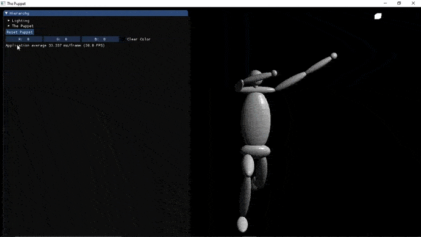
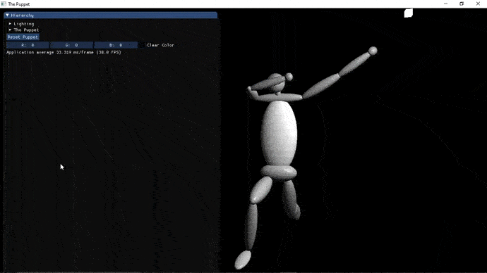

# The Puppet
<!--

  
-->

## Description

Para esta tarea se implementó una cámara de perspectiva que se controla con WASD

- W: Arriba
- S: Abajo
- A: Izquierda
- D: Derecha

Además, se puede rotar la cámara sobre su mismo eje al mover el ratón mientras se hace clic con el boton derecho del ratón.

La marioneta fue diseñada a partir de un modelo jerárquico, donde cada extremidad esta diseñada por una esfera, donde se le aplicaron sus correspondientes transformaciones para formar a esta.

Se cuenta con una interfaz básica echa con [ImGui](https://github.com/ocornut/imgui), para poder controlar a la marioneta. El torso se puede rotar como trasladar, mientras que las demás extremidades solamente se pueden rotar. No se implemento un límite para las rotaciones para que no se hagan movimientos “extraños”.

También se cuenta con un sistema básico de iluminación que cuenta con una única luz representada por un cubo.

Así como un botón para reiniciar la marioneta a su configuración inicial.

Se aplico la prueba de profundidad a partir de las funciones que ya cuenta OpenGl.

## Fuentes

- [The Cherno - OpenGL Series](https://www.youtube.com/playlist?list=PLlrATfBNZ98foTJPJ_Ev03o2oq3-GGOS2)
- [Learn OpenGL](https://learnopengl.com)
- [OpenGl - Tutorial](http://www.opengl-tutorial.org/es/)